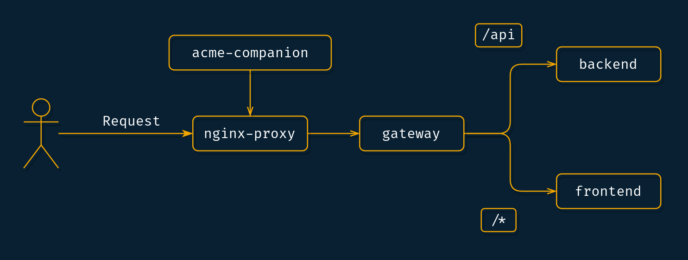

# Simple LetsEncrypt NGINX Subpath Docker-Config

Just a basic docker-compose file that I use for prototyping.\
It uses a single domain-name to host both a front- and backend. The `gateway` forwards all requests for `/api` to the backend-service, everything else is received by the frontend. 




\
\
[docker-compose.yml](docker-compose.yml)


```yaml
version: "3.3"
services:
  nginx-proxy:
    image: nginxproxy/nginx-proxy:latest
    ports:
      - "80:80"
      - "443:443"
    volumes:
      - conf:/etc/nginx/conf.d
      - vhost:/etc/nginx/vhost.d
      - html:/usr/share/nginx/html
      - certs:/etc/nginx/certs
      - /var/run/docker.sock:/tmp/docker.sock:ro

  nginx-proxy-letsencrypt:
    image: nginxproxy/acme-companion:latest
    volumes_from:
        - nginx-proxy
    volumes:
        - /var/run/docker.sock:/var/run/docker.sock:ro
        - acme:/etc/acme.sh

  gateway:
    image: nginx:latest
    volumes:
    - ./nginx.conf:/etc/nginx/nginx.conf
    environment:
    - VIRTUAL_HOST=app.example.com
    - LETSENCRYPT_HOST=app.example.com
    - LETSENCRYPT_EMAIL=albert_h@example.com
    - DEFAULT_EMAIL=albert_h@example.com

  backend:
    image: containous/whoami
  
  frontend:
    image: containous/whoami


volumes:
  conf:
  vhost:
  html:
  dhparam:
  certs:
  acme:
```
\
\
[nginx.conf](nginx.conf)

```nginx
user  nginx;
worker_processes  1;

error_log  /var/log/nginx/error.log;

events {
    worker_connections  1024;
}


http {
  server {
    listen 80;
    location / {
        proxy_pass http://frontend/;
    }
    location /api {
        proxy_pass http://backend/api; # Different port: http://backend:8080/api
    }
  }
}


```
